# deep_learning_01

[TOC]

## 1. 神经网络初识

### 1.1. 基本单元结构

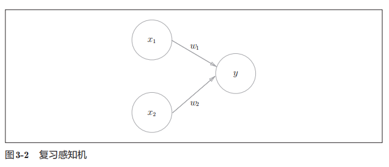

该神经元基本结构有两个输入`x1`, `x2`，一个输出`y`。其公式为：

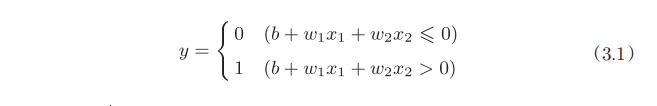

公式中：

- `b`被称为偏置参数，用于控制神经元被激活的容易程度

- `w1`和`w2`是表示各个输入信号的权重，用于控制各个输入信号的重要程度

明确标出偏置参数，如下图：

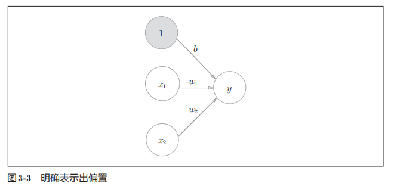

### 1.2. 激活函数

对于`y`的值，我们还可以用**激活函数**进一步处理：

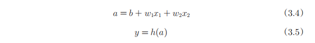

先计算 加权输入信号 与 偏置 的总和，记为`a`。然后，用激活函数`h()`将`a`转换为输出`y`。如图：

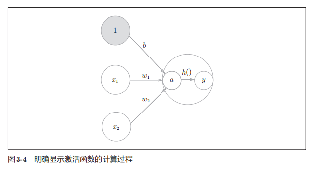

常见的激活函数有：

- sigmoid函数

    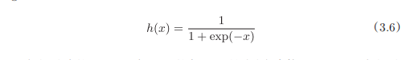

- 阶跃函数

    

- ReLU(Rectified Linear Unit)函数

    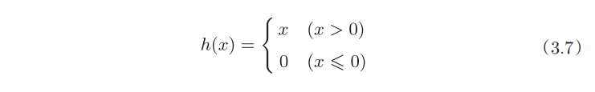

- ......

值得注意的是，激活函数大多为**非线性函数**。原因在于：

> 线性函数的问题在于，不管如何加深层数，总是存在与之等效的“无隐藏层的神经网络”。为了具体地（稍微直观地）理解这一点，我们来思考下面这个简单的例子。这里我们考虑把线性函数 h(x) = cx 作为激活函数，把y(x) = h(h(h(x)))的运算对应3层神经网络A。这个运算会进行y(x) = c × c × c × x的乘法运算，但是同样的处理可以由y(x) = ax（注意，a = c^3）这一次乘法运算（即没有隐藏层的神经网络）来表示。

### 1.3. 隐藏层

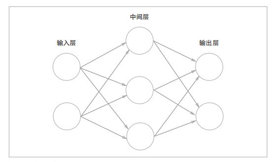

当神经网络有多层时，中间的层称为中间层或隐藏层。隐藏层的输入为上一层的输出，隐藏层的输出为下一层的输入，对隐藏层的输出同样可以使用**激活函数**。

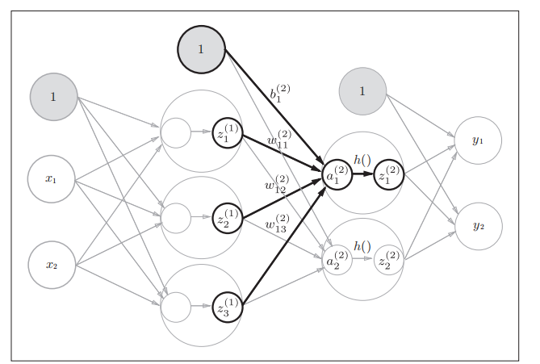

### 1.4. 神经网路的内积

**值得注意的是，一个神经元的输出会传递到下一层的每个神经元上**。

所以，对于某一层而言：

- 输入`X`、输出`Y`可以分别看作`1 x len(X)`、`1 x len(Y)`的一维矩阵；

- 每根箭头上的权重可以看作`len(X) x len(Y)`的二维矩阵；

- 每个输出神经元对应的偏置参数可以看作一个`1 x len(Y)`大小的一维矩阵。

如下图(未列出偏置参数)：

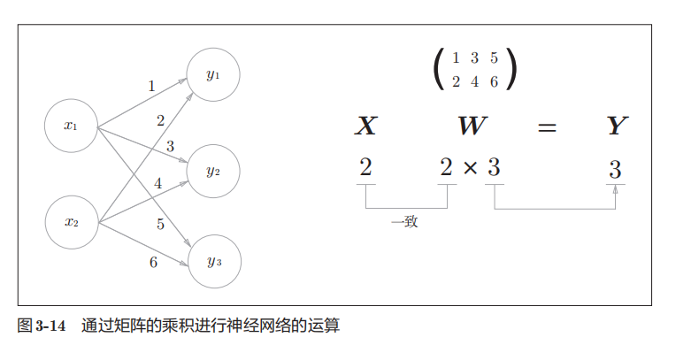

最后输出`Y = (y1=x1*w1+x2*w2, y2=x1*w3+x2*w4, y3=x1*w5+x2*w6)`。

完整公式如下：

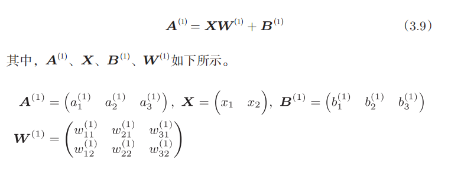

### 1.5. 输出层的激活函数

神经网络可以用在分类问题和回归问题上，不过需要根据情况改变输出层的激活函数。

一般而言，**回归**问题用**恒等函数**，**分类**问题用**softmax函数**。

#### 1.5.1 回归 恒等函数

对于回归问题，用恒等函数，即直接输出a值。

```math
y = a = h(a) = WX + B
```

#### 1.5.2. 分类 softmax函数

对于分类问题，输出层的神经元数量一般设定为类别的数量，其激活函数使用`softmax`函数。

函数公式如下：

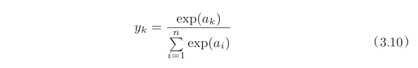

第k个神经元的输出`yk`，等于`ak`的指数函数除于所有`ai`的指数函数的和。

### 1.6. 值得注意

对于一个神经元，我们可以通过调节权重和偏置参数来产生不同的输出值。

而对于一个神经网络，我们可以调节每一层的权重和偏置参数，最终得到我们想要的输出结果。

[一个用于神经网络深度学习的生动有趣的网站](http://playground.tensorflow.org/#activation=tanh&batchSize=10&dataset=xor&regDataset=reg-plane&learningRate=0.03&regularizationRate=0&noise=0&networkShape=1&seed=0.02796&showTestData=false&discretize=false&percTrainData=50&x=true&y=true&xTimesY=false&xSquared=true&ySquared=false&cosX=false&sinX=false&cosY=false&sinY=false&collectStats=false&problem=classification&initZero=false&hideText=false)

## 2. Tensorflow

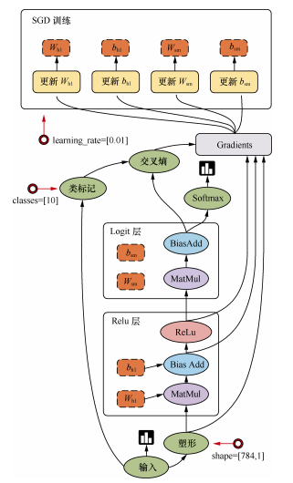

用户只需构建网络模型，`Tensorflow`框架就会根据每次训练的输出结果，进行自动调参。

### 2.1. 回归问题

参考 [1-简单示例-tensorflow结构.ipynb](1-简单示例-tensorflow结构.ipynb), [2-非线性回归.ipynb](2-非线性回归.ipynb), [3-建造我们第一个神经网络.ipynb](3-建造我们第一个神经网络.ipynb)
