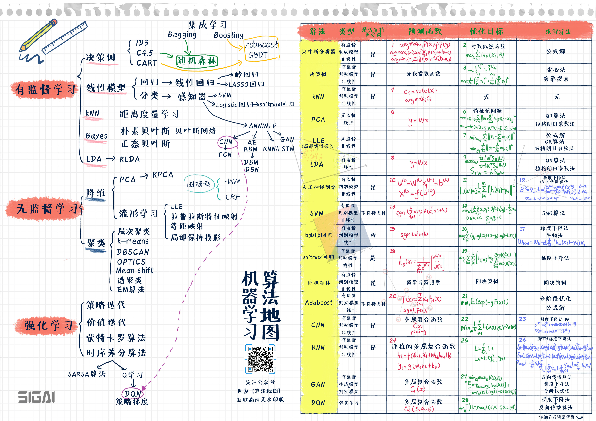

# sklearn 03

## 机器学习导图



## 模型评估指标

### 分类模型评估

分类模型(根据一系列特性值得出其类别，即离散的结果)，如逻辑回归、支持向量机(SVM)、决策树等。

通过**二维混淆矩阵**进行评估：

```py
sklearn.metrics.confusion_matrix(y_true, y_pred, labels=None, sample_weight=None)

- y_true: 是样本真实分类结果
- y_pred: 是样本预测分类结果
- labels: 是所给出的类别，通过这个可对类别进行选择
- sample_weight: 样本权重

                                预测结果

真实类别            类别1（正例）               类别2（反例）

类别1（正例）   真正例(True Positive) TP    假反例(False Negatibe) FN

类别2（反例）   假正例(False Positive) FP   真反例(True Negatibe) TN
```

其指标有：

- `sklearn.metrics.accuracy_score(y_true, y_pred)` 准确率

- `precision_score(y_true, y_pred)` 精确率

- `recall_score(y_true, y_pred)` 召回率

- `f1_score(y_true, y_pred)` F1-score

综合指标信息：

```py
`sklearn.metrics.classification_report()` 函数用于显示主要分类指标的文本报告，在报告中显示每个类的精确度、召回率、F1值等信息。

主要参数:

- y_true：1维数组，或标签指示器数组/稀疏矩阵，目标值。
- y_pred：1维数组，或标签指示器数组/稀疏矩阵，分类器返回的估计值。
- labels：array，shape = [n_labels]，报表中包含的标签索引的可选列表。
- target_names：字符串列表，与标签匹配的可选显示名称（相同顺序）。
- sample_weight：类似于shape = [n_samples]的数组，可选项，样本权重。
- digits：int，输出浮点值的位数。
```

示例详情见 `./stu_01.py` 和 `模型算法常用评价指标.jpynb`

### 回归模型评估指标

- `sklearn.metrics.mean_squared_error`  均方差
- `sklearn.metrics.mean_absolute_error`  平均绝对值误差
- `sklearn.metrics.explained_variance_score`  可释方差得分
- `sklearn.metrics.r2_score`  .R2 决定系数（拟合优度）。拟合优度越大，自变量对因变量的解释程度越高，自变量引起的变动占总变动的百分比高。观察点在回归直线附近越密集。

详情见 `stu_02.py` 和 `模型算法常用评价指标.jpynb`

## 数据预处理

对于进行模型训练的数据：

- 首先要明确有多少特征，哪些是连续的，哪些是类别的。
- 检查有没有缺失值，对确实的特征选择恰当方式进行弥补，使数据完整。
- 对连续的数值型特征进行标准化，使得均值为0，方差为1。
- 对类别型的特征进行one-hot编码。
- 将需要转换成类别型数据的连续型数据进行二值化。
- 为防止过拟合或者其他原因，选择是否要将数据进行正则化。
- 在对数据进行初探之后发现效果不佳，可以尝试使用多项式方法，寻找非线性的关系。
- 根据实际问题分析是否需要对特征进行相应的函数转换。、

### 标准化

函数：`sklearn.preprocessing.scale(x)` 将每一列特征标准化为标准正太分布，注意，标准化是针对每一列而言的。

类：`scaler = preprocessing.StandardScaler(copy=True, with_mean=True, with_std=True)` 初始化一个用于标准化转换的对象。例如:

    一般会把train和test集放在一起做标准化，或者在train集上做标准化后，用同样的标准化器去标准化test集，此时可以用scaler

    scaler = sklearn.preprocessing.StandardScaler().fit(train)
    scaler.transform(train)
    scaler.transform(test)

### 标签二值化

若某个特性只有两种情况，那么就可以变为0、1两个值。

```py
from sklearn import preprocessing
labelList=['yes', 'no', 'no', 'yes']
# 将标签矩阵二值化
lb = preprocessing.LabelBinarizer() # 创建对象
dummY = lb.fit_transform(labelList)
```

### 标签编码

```py
le = preprocessing.LabelEncoder()
le.fit([1, 2, 2, 6])
le.transform([1, 1, 2, 6]) #array([0, 0, 1, 2])
```

更多详情见 `stu_03.py` 和 `数据预处理.jpynb`

## 交叉验证

## 模型调参
