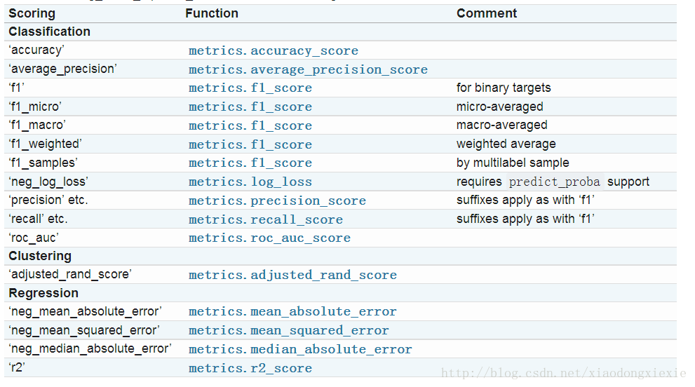

# sklearn 03

[TOC]

## 1. 机器学习导图


## 2. 模型评估指标(sklearn.metrics)

### 2.1. 分类模型评估

分类模型(根据一系列特性值得出其类别，即离散的结果)，如逻辑回归、支持向量机(SVM)、决策树等。

通过**二维混淆矩阵**进行评估：

```py
sklearn.metrics.confusion_matrix(y_true, y_pred, labels=None, sample_weight=None)
```

- y_true: 是样本真实分类结果
- y_pred: 是样本预测分类结果
- labels: 是所给出的类别，通过这个可对类别进行选择
- sample_weight: 样本权重

|真实类别\预测结果|类别1（正例）|类别2（反例）|
|---|---|---|
|类别1（正例）|真正例(True Positive) TP|假反例(False Negatibe) FN|
|类别2（反例）|假正例(False Positive) FP|真反例(True Negatibe) TN|

其指标有：

- `sklearn.metrics.accuracy_score(y_true, y_pred)` 准确率

- `sklearn.metrics.precision_score(y_true, y_pred)` 精确率

- `sklearn.metrics.recall_score(y_true, y_pred)` 召回率

- `sklearn.metrics.f1_score(y_true, y_pred)` F1-score

综合指标信息：

```py
sklearn.metrics.classification_report()
```

该函数用于显示主要分类指标的文本报告，在报告中显示每个类的精确度、召回率、F1值等信息。

主要参数:

- y_true：1维数组，或标签指示器数组/稀疏矩阵，目标值。
- y_pred：1维数组，或标签指示器数组/稀疏矩阵，分类器返回的估计值。
- labels：array，shape = [n_labels]，报表中包含的标签索引的可选列表。
- target_names：字符串列表，与标签匹配的可选显示名称（相同顺序）。
- sample_weight：类似于shape = [n_samples]的数组，可选项，样本权重。
- digits：int，输出浮点值的位数。

示例详情见 [stu_01.py](stu_01.py) 和 [模型算法常用评价指标.ipynb](../模型算法常用评价指标.ipynb)

### 2.2. 回归模型评估指标

- `sklearn.metrics.mean_squared_error`  均方差
- `sklearn.metrics.mean_absolute_error`  平均绝对值误差
- `sklearn.metrics.explained_variance_score`  可释方差得分
- `sklearn.metrics.r2_score`  .R2 决定系数（拟合优度）。拟合优度越大，自变量对因变量的解释程度越高，自变量引起的变动占总变动的百分比高。观察点在回归直线附近越密集。

分类和回归模型评估方法归纳总结如下：



详情见 [stu_02.py](./stu_02.py) 和 [模型算法常用评价指标.ipynb](../模型算法常用评价指标.ipynb)

## 3. 数据预处理(sklearn.preprocessing)

对于进行模型训练的数据：

- 首先要明确有多少特征，哪些是连续的，哪些是类别的。
- 检查有没有缺失值，对确实的特征选择恰当方式进行弥补，使数据完整。
- 对连续的数值型特征进行标准化，使得均值为0，方差为1。
- 对类别型的特征进行one-hot编码。
- 将需要转换成类别型数据的连续型数据进行二值化。
- 为防止过拟合或者其他原因，选择是否要将数据进行正则化。
- 在对数据进行初探之后发现效果不佳，可以尝试使用多项式方法，寻找非线性的关系。
- 根据实际问题分析是否需要对特征进行相应的函数转换。、

### 3.1. 标准化

- 函数：`sklearn.preprocessing.scale(x)` 将每一列特征标准化为标准正太分布，注意，标准化是针对每一列而言的。

- 类：`scaler = preprocessing.StandardScaler(copy=True, with_mean=True, with_std=True)` 初始化一个用于标准化转换的对象。例如:

    一般会把train和test集放在一起做标准化，或者在train集上做标准化后，用同样的标准化器去标准化test集，此时可以用scaler。

    ```py
    scaler = sklearn.preprocessing.StandardScaler().fit(train)
    scaler.transform(train)
    scaler.transform(test)
    ```

### 3.2. 标签二值化

若某个特性只有两种情况，那么就可以变为0、1两个值。

```py
from sklearn import preprocessing
labelList=['yes', 'no', 'no', 'yes']
# 将标签矩阵二值化
lb = preprocessing.LabelBinarizer() # 创建对象
dummY = lb.fit_transform(labelList)
```

### 3.3. 标签编码

将标签转换成数值型数据

```py
from sklearn import preprocessing
le = preprocessing.LabelEncoder()
le.fit([1, 2, 2, 6]) # 1编码为0，2编码为1，6编码为2
le.transform([1, 1, 2, 6]) #array([0, 0, 1, 2])
```

### 3.4. 其它

- 最小-最大规范化

- 归一化

- 类别特征编码(OneHotEncoder独热编码)

更多详情见 [stu_03.py](./stu_03.py) 和 [数据预处理.ipynb](../数据预处理.ipynb)

## 4. 数据集划分(sklearn.model_selection)

衡量模型好坏的标准是看这个模型在**新的数据集**上面表现的如何，也就是看它的**泛化误差**。

于是我们需要在数据集D上面划分出来一小部分数据测试D的性能，用它来近似代替泛化误差。

有三种方法可以进行上面的划分操作：**留出法**、**交叉验证法**、**自助法**。

- 留出法，将数据集分为训练集和测试集。

- 自助法，略。

- 交叉验证法，通常把数据集D分为k份，每一次选其中一份作为测试集(不重复)，剩下为训练集，选k次，这样就可以进行k次训练与测试，最终返回k次测试的结果。

### 4.1. 留出法

```py
from sklearn.model_selection import train_test_split

# 对数据集进行快速打乱，并划分训练集和测试集
# test_size 测试集的占比
X_train, X_test, y_train, y_test = train_test_split(X, y, test_size=0.4, random_state=0)
```

### 4.2. 交叉验证

把数据集D分为k份，每一次选其中一份作为测试集(不重复)，剩下为训练集，选k次，这样就可以进行k次训练与测试，最终返回k次测试的结果

#### 4.2.1. Model 交叉验证法(cross_val_score)

```py
from sklearn.model_selection import cross_val_score # K折交叉验证模块

# 对数据集进行指定次数的交叉验证，并为每次验证效果评测
scores = cross_val_score(
    estimator, # 必须，模型实例，如传入决策树模型实例 DecisionTreeClassifier()
    X, # 必须，数据集，将被拆分成k份
    y=None, # 结果集
    groups=None,
    scoring=None, # 评估方式，根据分类或回归模型进行选择
    cv='warn', # cv 默认使用 KFold 或 StratifiedKFold 进行数据集打乱
    n_jobs=None,
    verbose=0,
    fit_params=None,
    pre_dispatch='2*n_jobs',
    error_score='raise-deprecating',
)
```

`scoring` 默认是以 `scoring='f1_macro'` 进行评测，其余针对`分类(Classification)或回归(Regression)`还有：


示例：

```py
from sklearn.neighbors import KNeighborsClassifier # k-邻近法模型
from sklearn.model_selection import cross_val_score

scores = cross_val_score(KNeighborsClassifier(n_neighbors=5), X, y, scoring='accuracy', cv=5)
print(scores) # [0.96666667  1.  0.93333333  0.96666667  1.]
```

#### 4.2.2. 交叉预测 cross_val_predict

返回 分类或回归模型 对 同一数据集 进行 交叉训练后 对 每次测试集 的 预测结果 。

```py
from sklearn.model_selection import cross_val_predict
from sklearn.neighbors import KNeighborsClassifier # k-邻近法模型
from sklearn import metrics

predicted = cross_val_predict(KNeighborsClassifier(n_neighbors=5), X, y, cv=10)
metrics.accuracy_score(y, predicted)
```

#### 4.2.3. KFold

仅仅将数据集分成k折，不负责训练模型。

示例：

```py
from sklearn.model_selection import KFold
from sklearn import linear_model

kf = KFold(n_splits=5)
for train, test in kf.split(X):
    # 岭回归
    ridgeModel = linear_model.Ridge().fit(X[train], y[train])
    print("train score: {0:.3f}, test score: {1:.3f}\n".format(
        ridgeModel.score(X[train], y[train]),
        ridgeModel.score(X[test], y[test])))
```

等同于：

```py
test_score = cross_val_score(linear_model.Ridge(), X, y, scoring='r2', cv=5)
```

#### 4.2.4. 其它

- LeaveOneOut

- LeavePOut

- ShuffleSplit

- StratifiedKFold

详情见 [交叉验证.ipynb](../交叉验证.ipynb)

## 5. 模型调参(sklearn.model_selection)

### 5.1. GridSearchCV

网格调参，其实就是**排列组合**传入的各参数列表，所以会很慢。

```py
from sklearn.model_selection import GridSearchCV

grid = GridSearchCV(
    estimator, # 所使用的分类\回归模型
    param_grid, # 字典或列表，即需要优化的参数的可能取值
    scoring=None, # 评估方法
    cv=None, # 交叉验证参数
    fit_params=None, n_jobs=1, iid=True,
    refit=True, verbose=0, pre_dispatch='2*n_jobs',
    error_score='raise', return_train_score='warn')

grid.fit(train_x, train_y) # 运行网格搜索

grid.grid_scores_ # 给出不同参数情况下的评价结果
grid.best_params_ # 描述了已取得最佳结果的参数的组合
grid.best_score_ # 成员提供优化过程期间观察到的最好的评分
grid.best_estimator_ # 获取最佳度量时的分类器模型
```

示例：

```py
from sklearn.grid_search import GridSearchCV
from sklearn.ensemble import RandomForestRegressor

# 随机森林的参数
param_grid={
    'min_sample_split': [3,6,9],
    'n_estimators':[10,50,100]
}

grid=GridSearchCV(RandomForestRegressor(), param_grid=param_grid, cv=5)
grid.fit(x,y)

print('网格搜索-度量记录：',grid.cv_results_)  # 包含每次训练的相关信息

print('网格搜索-最佳度量值:',grid.best_score_)  # 获取最佳度量值
print('网格搜索-最佳参数：',grid.best_params_)  # 获取最佳度量值时的代定参数的值。是一个字典
print('网格搜索-最佳模型：',grid.best_estimator_)  # 获取最佳度量时的分类器模型
```

### 5.2. 其它

- RandomizedSearchCV 随机搜索

详情和更多示例见：[模型调参.ipynb](../模型调参.ipynb)、[Adaboost_demo.py](./Adaboost_demo.py) 和 [homework目录](homework/)
